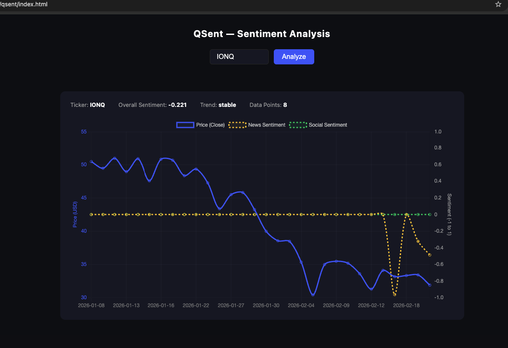

# Quantum Market Forecasting Pipeline

## Project Overview

This project builds an end-to-end, AI pipeline for generating daily stock price movement predictions for companies in the **Quantum Computing industry**.

At a high level, the system:

1. Ingests **daily market data** (prices, volume, etc.)
2. Ingests **news and social media data**
3. Applies **financial sentiment analysis**
4. Combines sentiment signals with **traditional forecasting models**
5. Generates **price movement predictions**
6. Stores predictions and supporting evidence in a database
7. Exposes results via a **dashboard**, including:
   - The prediction
   - Confidence / uncertainty (where applicable)

This repository is structured to support **collaborative development**, **reproducible research**, and eventual deployment as a working product.

---

## Repository Structure

Below is a brief guide to what each top-level directory is for.

### `docs/`
Project documentation.
- `architecture/`: system design, data flow, agent interactions
- `decisions/`: architecture decision records (why we chose certain tools)
- `runbooks/`: how to run, debug, or deploy the system

If you’re new to the project, start here.

---

### `configs/`
Configuration files (YAML).
- Environment settings (dev vs prod)
- Model and pipeline parameters
- Prompt templates for LLM-based agents

Avoid hardcoding parameters elsewhere — configs should live here.

---

### `data/`
Data directory **(mostly gitignored)**.
- `raw/`: unprocessed data pulled from external sources
- `external/`: third-party datasets
- `interim/`: partially processed data
- `processed/`: clean datasets ready for modeling
- `features/`: model-ready feature tables
- `labels/`: targets / outcomes used for training

See `data/README.md` for data handling rules.

---

### `notebooks/`
Exploratory and research notebooks.
- Used for prototyping, analysis, and validation
- Not used directly in production pipelines

Folder numbering reflects the typical workflow order.

---

### `src/qsf/`
The **core Python package** (all production code lives here).

Key submodules:

- `common/`  
  Shared utilities, constants, schemas, logging, and helper functions

- `ingestion/`  
  Code for pulling in:
  - Market data
  - News articles
  - Social media content

- `nlp/`  
  Text cleaning, embeddings, sentiment models, and aggregation logic

- `features/`  
  Feature engineering that combines market data + sentiment signals

- `forecasting/`  
  Time-series and ML models for predicting price movements

- `backtesting/`  
  Walk-forward evaluation, leakage checks, and performance metrics

- `agents/`  
  Multi-agent orchestration layer used to:
  - Coordinate pipeline steps
  - Generate human-readable explanations
  - Retrieve supporting evidence

- `pipelines/`  
  End-to-end runnable workflows (ETL, training, inference, backtesting)

- `api/`  
  FastAPI application exposing predictions and explanations to the dashboard

---

### `tests/`
Automated tests.
- `unit/`: individual functions and components
- `integration/`: multi-step pipeline tests
- `fixtures/`: small test datasets

All new production code should include tests where feasible.

---

### `scripts/`
Helper scripts for:
- One-off data pulls
- Local pipeline runs
- Developer utilities

---

### `infrastructure/`
Deployment and infrastructure code.
- `docker/`: Dockerfiles and docker-compose
- `terraform/`: (optional) cloud infrastructure
- `github/workflows/`: CI/CD pipelines

---

### `reports/`
Generated outputs and artifacts.
- Backtest results
- Weekly summaries
- Figures and plots used in presentations

---

## Sentiment Chart Prototype

A browser prototype is served directly by the API at `http://localhost:8000`. It renders three lines over time for any ticker:

- **Price** (left Y-axis, USD)
- **News sentiment** (right Y-axis, -1 to 1)
- **Social sentiment** (right Y-axis, -1 to 1)



### Running the prototype

1. Start the API (see below)
2. Open `http://localhost:8000` in your browser
3. Sign in with Google (see Authentication below)
4. Type a ticker and click **Analyze**

No build step required — Chart.js is loaded from CDN.

---

## Authentication

The app uses **Google SSO**. All API endpoints (except `/health`) require a valid session.

When you open `http://localhost:8000`, you will be redirected to a login page. Click **Sign in with Google** and complete the OAuth flow. Your session is stored in a secure, HttpOnly cookie that expires after 8 hours.

To log out, visit `http://localhost:8000/auth/logout`.

### Bypassing login during local development

To skip Google SSO when testing locally, start the server with `TEST_MODE=true`:

```bash
TEST_MODE=true uvicorn qsf.api.main:app --reload
```

Then visit `http://localhost:8000/auth/test-login` once — it sets a session cookie and drops you straight into the app. This route is only registered when `TEST_MODE=true` and is never available in production.

### Adding team members

Any Google account can sign in — no manual allowlist needed. If teammates see a Google warning screen during login, make sure the OAuth consent screen is published in Google Cloud Console (APIs & Services → OAuth consent screen → Publish App).

---

## Running the API Locally

### 1. Install dependencies

```bash
python -m venv .venv
source .venv/bin/activate
pip install -e ".[dev]"
```

MacOS
```bash
python3 -m venv .venv
source .venv/bin/activate
pip install -e ".[dev]"
```

### 2. Set up environment variables

Copy the example file and fill in your keys:

```bash
cp .env.example .env
```

Required keys:
```
# Google OAuth (see Authentication section above)
GOOGLE_CLIENT_ID=
GOOGLE_CLIENT_SECRET=
SECRET_KEY=                  # generate with: openssl rand -hex 32
BASE_URL=http://localhost:8000
SECURE_COOKIES=false

# Data sources
NEWS_API_KEY=
REDDIT_CLIENT_ID=
REDDIT_CLIENT_SECRET=
REDDIT_USER_AGENT=qsent/0.1
HUGGINGFACE_API_KEY=
```

To get `GOOGLE_CLIENT_ID` and `GOOGLE_CLIENT_SECRET`, create an OAuth 2.0 client in [Google Cloud Console](https://console.cloud.google.com) under APIs & Services → Credentials. Set the authorized redirect URI to `http://localhost:8000/auth/callback`.

### 3. Start the server

```bash
uvicorn qsf.api.main:app --reload
```

The `--reload` flag restarts the server automatically when you edit source files.

### 4. Explore the interactive API docs

FastAPI generates a live, interactive UI at:

```
http://127.0.0.1:8000/docs
```

From the docs page you can:
- See every endpoint, its expected inputs, and its response schema
- Click **Try it out** on any endpoint and execute it directly from the browser
- See the real request being made and the full JSON response

### 5. Hit an endpoint manually

Health check:
```bash
curl http://127.0.0.1:8000/health
```

Analyze a ticker:
```bash
curl -X POST http://127.0.0.1:8000/analyze \
  -H "Content-Type: application/json" \
  -d '{"ticker": "IONQ"}'
```

The server terminal will print each incoming request as it is processed:
```
INFO:     127.0.0.1:PORT - "POST /analyze HTTP/1.1" 200 OK
```

### 6. Run the tests

Unit and integration tests:
```bash
pytest tests/unit/ tests/integration/
```

E2E tests (Playwright) must be run manually on your local machine — they require a running server and a real browser. They cannot be run by automated test runners (e.g. CI agents) without additional setup.

```bash
# First time only — install Chromium
playwright install chromium

# Terminal 1: start the server with test mode enabled
TEST_MODE=true uvicorn qsf.api.main:app --reload

# Terminal 2: run E2E tests
pytest tests/e2e/
```

If `playwright` is not found, make sure your venv is active (`source .venv/bin/activate`).

---

## How to Contribute (High-Level)

- Use **branches + pull requests**
- Keep experimental work in **notebooks/**
- Put reusable logic in **src/qsf/**
- Document assumptions and decisions
- When in doubt, ask before refactoring shared code

---

## Project Status

This is an **active, collaborative research and engineering project**.  
Expect some interfaces to evolve as we learn what works.

